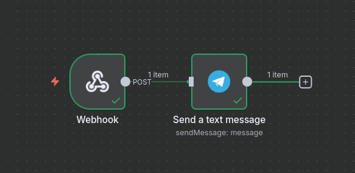

# Go Balancer

This is a short project to learn some basics about _Golang_. Thinking about a project to implement I thought it would be fun to make something useful and simple in theory. The goal is to have a rather small but good project so that I can show some basic skills in go

## What is the project about?

I am trying to create a load balancer in _Go_ for learing purposes. In general the idea is simple. Let's say we have a service in a number of servers running and we need a service to distribute traffic out for many users. In most of the small projects that's not a problem but with huge loads a load balancer is a good solution.

Idealy you wouldn't write your own load balancer but you would use a service like AWS, Cloudflare or Nginx etc. So getting this out of the way we are going to make our own load balancer with go with some simple algorithms and a list of more features you can see below!

The goal for me would be create some mock services with silly data and try to see how each algorithm treats the request and do tests around those

## Features / What's next?

So here will be a list of goals and what is already achived so I will call this done when most of them are fixed.

- Support more algorithms
  - ~~Round Robin~~
  - Weighted Round Robin
  - Least Connections
  - Weighted Least Connections
  - IP Hash
  - ~~Least Response Time~~
  - ~~Random~~
- ~~Have a great way to "deploy" the balancer (docker or releases)~~
- ~~Health check on servers~~
- ~~n8n workflow that triggers with a webhook when a server is down to get telegram notifications~~
- ~~Give a way to create test servers for testing the system~~
- Test the algorithms and the proxy system with unit tests
- Recovery system for the Down servers
- **Hot** having a database to store basic stats for distribution
- Store uptime for each server (like Kume does)

## How to run

You have a couple of ways to run this project

1. Clone this repo and use air to run it locally
2. Use the releases in git and install the latest executable
3. Also I would have dockerize it and let you docker pull it but it's not up in docker hub yet ):

How to write the config.json

```json
{
  "addr": ":8000", // the address that the load balancer runs
  "algorithm": "random", // the algorithm random, round-robin
  "webhook": "https://n8n.server.com/webhook-test/something", // the workflow you created in n8n
  "healthCheckDelay": 10, // the second between each ping in the servers
  "servers": [
    {
      "addr": "http://localhost:9000", // http url from each server
      "weigth": 0.9
    },
    {
      "addr": "http://localhost:9001",
      "weigth": 0.1
    },
    {
      "addr": "http://localhost:9002",
      "weigth": 0.1
    }
  ]
}
```

After this file is in place you will have the Go-balancer running and redirecting traffic to those servers and make them work better

## N8N Configuration

To make this work I expect to have an n8n instance up and running. Then create a new workflow with an notification service like discord, telegram, or anything other provider. Then you will be able to create a message like I did with telegram and get live information about the server status



## References

If for some reasons you want to make something same and you are here you might need to check those cause they did a much better work than I did and learned though them. Great work!!:

- https://medium.com/@shehaan.avishka00/build-reverse-proxy-to-hide-frontend-por-1dba1b05190a
- https://github.com/appleboy/loadbalancer-algorithms
- https://github.com/AAVision/traffic-balancer
- https://github.com/Zuyuf/Crafting-Own-Load-Balancer-with-Advanced-Features
