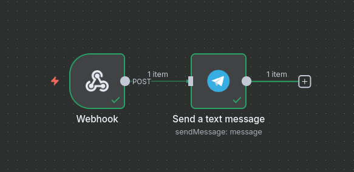

# Go Balancer


A lightweight reverse-proxy **load balancer written from scratch in Go**. Point it at a pool of backend servers and it distributes incoming traffic across them using a configurable algorithm, health-checks each backend, and fires a webhook (e.g. Telegram via n8n) the moment a server goes down.

> You'd normally reach for Nginx, HAProxy, or a cloud LB in production — this is a from-scratch implementation built to understand *how* they actually work: reverse proxying, balancing strategies, and health checking.

## Features

- **Pluggable balancing algorithms** — pick one in config:
  - ✅ Round Robin
  - ✅ Random
  - ✅ Least Response Time
- **Active health checks** — each backend is pinged on an interval and pulled from rotation when unhealthy.
- **Down-server alerting** — on failure it calls a configurable webhook; pair it with an n8n workflow to get Telegram/Discord notifications.
- **Built-in test servers** — spin up mock backends to watch how each algorithm distributes load.
- **Docker & releases** — runs from a prebuilt binary or as a container.

### Roadmap

- [ ] Weighted Round Robin, Least Connections, Weighted Least Connections, IP Hash
- [ ] Unit tests for the algorithms and proxy layer
- [ ] Automatic recovery for downed servers
- [ ] Persist distribution stats and per-server uptime in a database

## Architecture

```
            ┌──────────────┐  health checks   ┌────────────┐
  clients ─▶│  Go Balancer │ ───────────────▶ │ backend #1 │
            │  (reverse    │ ───────────────▶ │ backend #2 │
            │   proxy +    │ ───────────────▶ │ backend #3 │
            │   algorithm) │                  └────────────┘
            └──────┬───────┘
                   │ server down
                   ▼
            webhook → n8n → Telegram/Discord
```

## Getting started

**Run locally** (with [air](https://github.com/air-verse/air) for hot reload):

```bash
git clone https://github.com/NickNterm/go-balancer.git
cd go-balancer
air
```

Or grab a prebuilt binary from [Releases](https://github.com/NickNterm/go-balancer/releases), or run it in Docker via the included `Dockerfile`.

## Configuration

Create a `config.json` next to the binary:

```jsonc
{
  "addr": ":8000",              // address the load balancer listens on
  "algorithm": "round-robin",   // "round-robin" | "random" | "least-response-time"
  "webhook": "https://n8n.server.com/webhook-test/something", // called when a server goes down
  "healthCheckDelay": 10,       // seconds between health pings
  "servers": [
    { "addr": "http://localhost:9000", "weigth": 0.9 },
    { "addr": "http://localhost:9001", "weigth": 0.1 },
    { "addr": "http://localhost:9002", "weigth": 0.1 }
  ]
}
```

With the config in place, the balancer starts proxying incoming requests across the listed servers.

## Down-server notifications (n8n)

Run an n8n instance and create a workflow with a Webhook trigger feeding a notification node (Telegram, Discord, etc.). Point the `webhook` field above at that workflow and you'll get live alerts when a backend fails its health check.



## References

Projects and write-ups that helped while building this:

- [Build a reverse proxy to hide the frontend port](https://medium.com/@shehaan.avishka00/build-reverse-proxy-to-hide-frontend-por-1dba1b05190a)
- [appleboy/loadbalancer-algorithms](https://github.com/appleboy/loadbalancer-algorithms)
- [AAVision/traffic-balancer](https://github.com/AAVision/traffic-balancer)
- [Zuyuf/Crafting-Own-Load-Balancer-with-Advanced-Features](https://github.com/Zuyuf/Crafting-Own-Load-Balancer-with-Advanced-Features)

## License

Released under the [Apache License 2.0](LICENSE).
